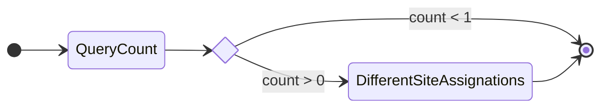

# EDAi - Estructura de Datos y Algoritmos 1 - Facultad de Ingeniería, UNAM
Códigos de las diapositivas
#
Diapositivas: [bit.ly/EDA1GVG](https://bit.ly/EDA1GVG)

```mermaid
stateDiagram
direction  LR
  state branch <<choice>>
  [*] --> QueryCount
  QueryCount --> branch
  branch --> DifferentSiteAssignations: count > 0
  branch --> [*]: count < 1
  DifferentSiteAssignations --> [*]
```
