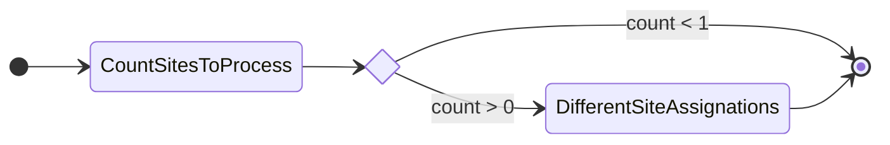
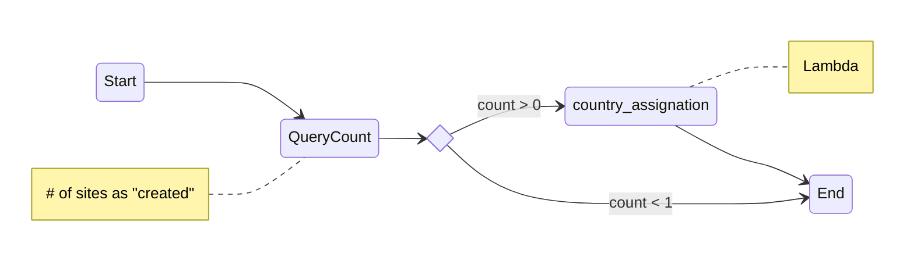
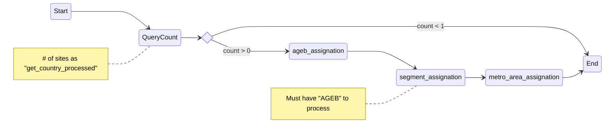

# EDAi - Estructura de Datos y Algoritmos 1 - Facultad de Ingeniería, UNAM
Códigos de las diapositivas
#
Diapositivas: [bit.ly/EDA1GVG](https://bit.ly/EDA1GVG)

# Site assignations

With these two DAGs we assginate country, AGEB (or similar), segment(s) and metropolitan zone to new sites.

We want to know -for the pipeline- which assignation is occurring (running) step by step. This is the reason why we check in every step if exists a site to process with the state necessary.

## DAG
### Name: get_site_country
#### File: [get_country.py](country/get_country.py)

We are using lambdas to connect and update the state in Postgres.

If the coordinates of the site are correct we put `get_country_processed` as state. Otherside we assign `get_country_failed`.

## DAG
### Dynamic Name: site_assignations_
#### File: [site_assignations_.py](more_assignations_/site_assignations_.py)

We are using lambdas to connect and update the state in Postgres.

If the coordinates of the site are correct we put `get_country_processed` as state othersite we assing `get_country_failed`.
