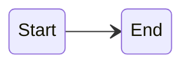
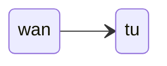

# Name
Description

## DAG
### Name: dag_name
#### File: [file_name.py](file_name.py)

We check if information exists:

```mermaid
stateDiagram
direction  LR
  Start --> End
```

`tg` is a `TaskGroup` with two tasks:

```mermaid
stateDiagram
direction  LR
  wan --> tu
```
