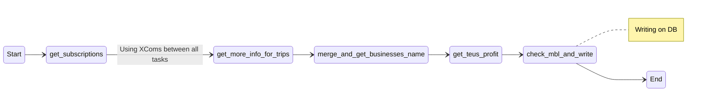

###### Documentation Proposal 
# P44 Dashboard
With this DAG we want to update the dashboard that we present in Metabase.

## DAG
### Name: p44_dashboard
#### File: [dag_p44_dashboard.py](dag_p44_dashboard.py)

We are using XComs to send information between the tasks.

